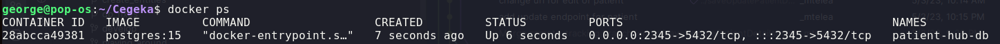

# be-patients-board-1
Patients Board backend project for team 1


## Figma
[Figma invite](https://www.figma.com/team_invite/redeem/0frX58c9uYY5SZt6QjH26V).  
[Figma app](https://www.figma.com/files/project/85287217/Team-project?fuid=1227273931196471268).  

## Board
[Trello board](https://trello.com/b/NfHY4ZKY/task-boarf).

# Patient Hub - Postgres Container Setup


## Prerequisites

- Docker installed on your machine

## Steps

1. Pull the PostgreSQL Docker image:

    ```
    docker pull postgres:15
    ```

2. Create a Docker container for the database:

    ```
    docker run --name patient-hub-db -e POSTGRES_USER=admin -e POSTGRES_PASSWORD=admin -p 2345:5432 -d --restart=always postgres:15
    ```

   This command will create a container named "patient-hub-db", with a PostgreSQL user named "admin" and password "admin".
The container's port 5432 will be mapped to port 2345 on your machine, and the container will run in detached mode with auto-restart enabled.

3. Check if the container is running
    
    ```
    docker ps -a
    ```
   You should see something like this: 
4. Connect to the database using the psql client:

    ```
    psql -h localhost -p 2345 -U admin -W postgres
    ```

   This command will connect to the database running in the Docker container using the psql client you will have to enter the password which is also "admin". This is only to test if the database is running. 

Note:
   You will need to create
   You will have to change application.properties from
   ```
   spring.datasource.url=jdbc:postgresql://localhost:5432/PacientHub
   ```
   to 
   ```
   spring.datasource.url=jdbc:postgresql://localhost:2345/PacientHub //or any port your container is mapped to.
   ```
   

   
# Setting up PgAdmin
   1. Right Click on Servers -> Register-> Server
   

   2. Choose a name for the server
   
   3. Set Host name to "localhost", port: 2345(the port of the container), username: admin, password: admin
   
   4. Save
   5. Right Click on "Databases" -> Create -> Database 
   
   6. Choose the name(in our case the name in the application.properties, "PacientHub")
   
   7. Switch to security tab, Click on "+" button next to "Privileges". 
   


