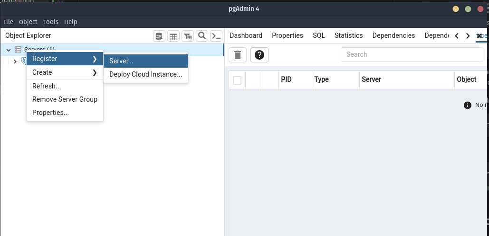
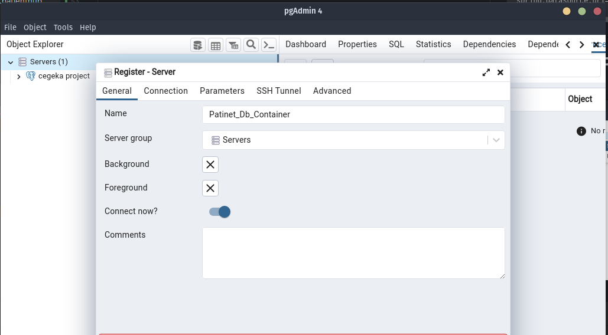
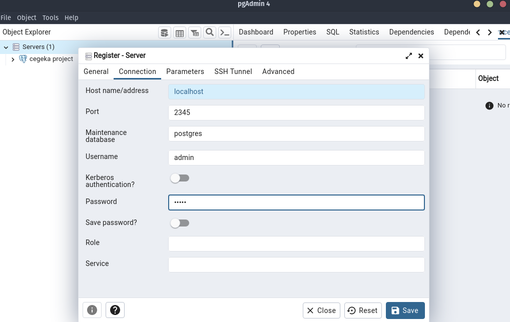
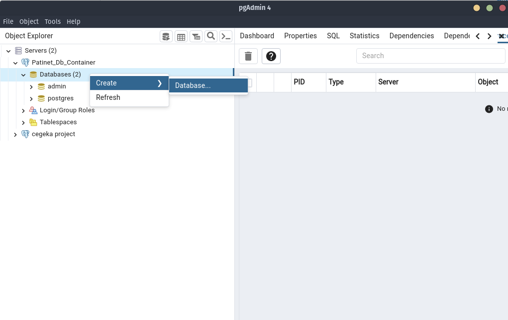
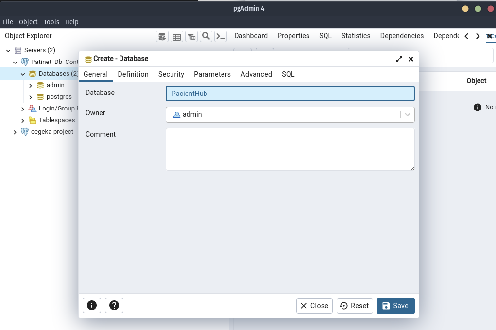
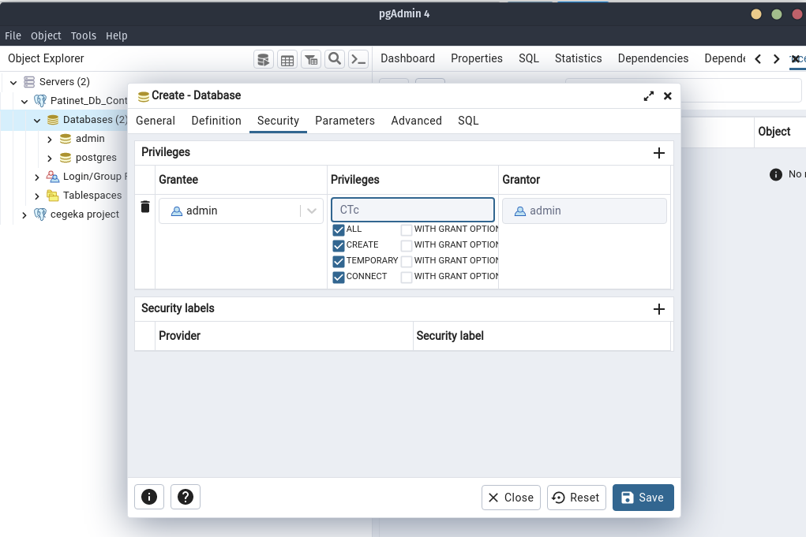

# be-patients-board-1
Patients Board backend project for team 1


## Figma
[Figma invite](https://www.figma.com/team_invite/redeem/0frX58c9uYY5SZt6QjH26V).  
[Figma app](https://www.figma.com/files/project/85287217/Team-project?fuid=1227273931196471268).  

## Board
[Trello board](https://trello.com/b/NfHY4ZKY/task-boarf).

# Patient Hub - Docker Setup

## Prerequisites

Docker installed on your machine.

 **1. Build docker image for the SpringBoot service**
 ```
 mvn clean install
 
 docker build -t app .  
 ```
 **2. Run docker containers for service and db**
 ```
 docker-compose up -d
 ```
 **3. Check if the containers are running**
 ```
 docker-compose ps
 ```
4. Connect to the database in the container using the psql client (password is "admin"):
 ```
 docker exec -t <CONTAINER_ID> psql -U admin -W postgres
 ```
5. To stop the containers run:
 ```
 docker-compose down
 ```


# Setting up PgAdmin
1. Right Click on Servers -> Register-> Server
   

2. Choose a name for the server
   
3. Set Host name to "localhost", port: 2345(the port of the container), username: admin, password: admin
   
4. Save
5. Right Click on "Databases" -> Create -> Database
   
6. Choose the name(in our case the name in the application.properties, "PacientHub")
   
7. Switch to security tab, Click on "+" button next to "Privileges".
   

## Spring Boot container
- Docker desktop is open 
 - run dockerFile pentru a se crea imaginea
 - docker ps -a (check if the container is running)
 - docker run -d  id_imagine id_container_creat (create and start a new container from the specified image)

